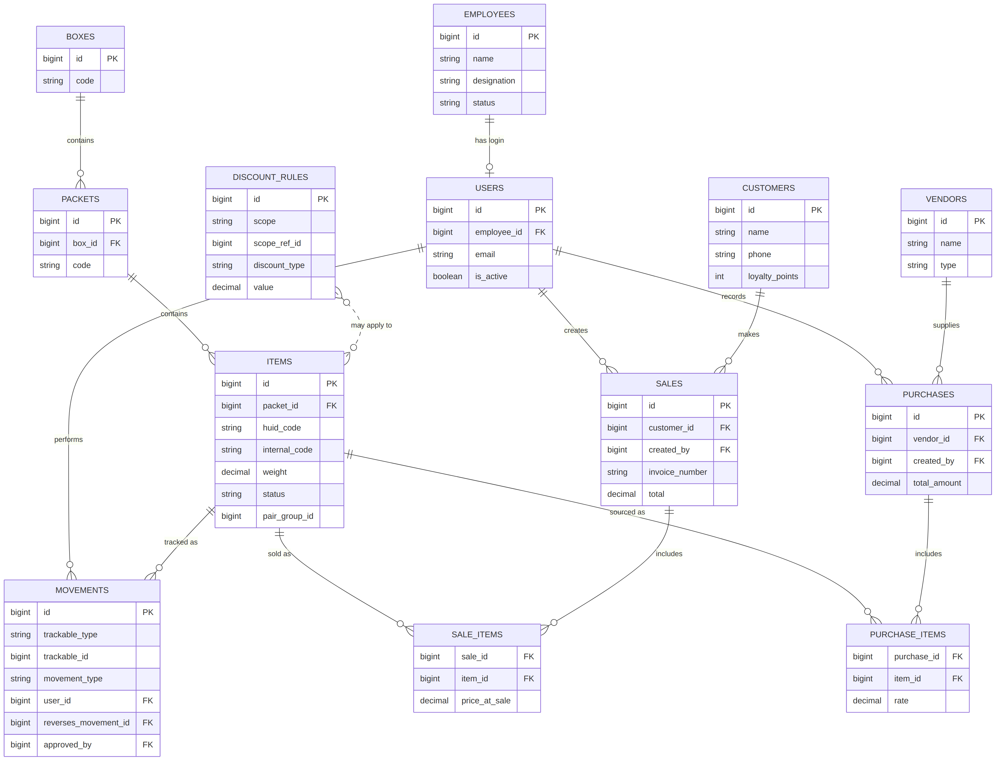
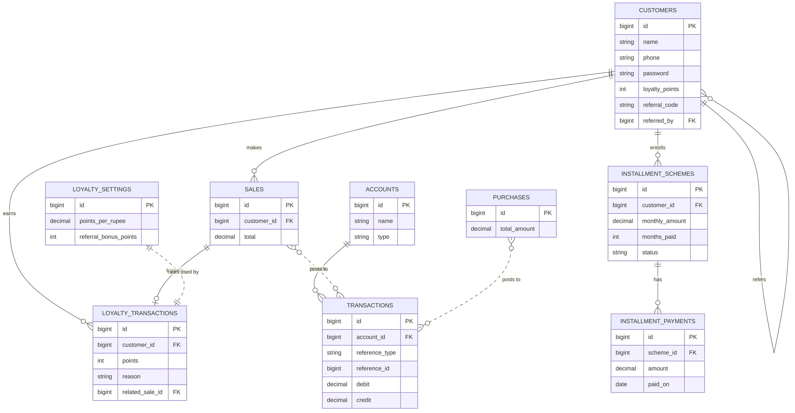

# Radharani Jewellery ERP — Finalized Schema Reference

Single source of truth for every table as it currently stands in the scaffold (24 migrations). This supersedes the table-by-table sections scattered across earlier design docs — if anything conflicts, this file wins.

## ER Diagrams

**Diagram 1 — Operational core:** Stock hierarchy (Boxes → Packets → Items), Movements, Sales, Purchases, Users/Employees


**Diagram 2 — Customer side:** Customers, Loyalty & Referral, Installments, Accounting Ledger


*Not shown in either diagram (standalone/reference tables, no hard FK relationships): `rate_logs`, `gst_rates`, `qr_codes`, `page_terms`. Full columns for these are below.*

*Keep both PNGs in the same folder as this file — the links above are relative.*

---

## Stock Hierarchy

**`jobs`, `job_batches`, `failed_jobs`** — standard Laravel queue tables, required because `QUEUE_CONNECTION=database`. Easy to forget since they're not part of any business-domain migration — omitting them breaks `queue:work` with "table jobs doesn't exist."

**`employees`** — id, name, phone, address, designation, salary, joining_date, status(active/inactive)

**`users`** — id, name, email, password, employee_id→employees(null), is_active, remember_token
*(+ password_reset_tokens, sessions — Laravel defaults, kept)*

**`boxes`** — id, code(unique), label

**`packets`** — id, box_id→boxes(null), code(unique), label

**`items`** — id, packet_id→packets(null), huid_code(null,idx), internal_code(null,idx), category, purity, weight, description, hsn_code(null), making_type(per_piece/percentage), making_value, pair_group_id(null), status(in_stock/dispatched/sold, idx)

---

## Movement Tracking

**`movements`** — id, trackable_type(item/packet/box), trackable_id, movement_type(vault_out/in, karigar_out/in, hallmark_out/in, photo_out/in, custom_out/in, melt_out/in, correction), purpose_label(null), user_id→users, counterparty(null), expected_return(null), actual_return(null), weight_at_dispatch(null), photo_path(null), bill_path(null), note(null), reverses_movement_id→movements(null), approved_by→users(null)
*idx: (trackable_type, trackable_id, created_at), (movement_type, created_at)*

**`rate_logs`** — id, metal(gold/silver), rate, source(manual/api), updated_by→users(null), created_at
*idx: (metal, created_at)*

---

## Pricing & Discounts

**`discount_rules`** — id, scope(item/category/box/packet/weight_tier), scope_ref_id(null), category(null), min_weight(null), max_weight(null), discount_type(flat/percentage), value, active, valid_from(null), valid_to(null), created_by→users
*idx: (scope, scope_ref_id), (active, valid_from, valid_to)*
*Precedence when computing a price: item → packet → box → category → weight_tier, first match wins.*

**`gst_rates`** — id, category, rate_percent

---

## Customers, Loyalty & Referral

**`customers`** — id, name, phone(idx), address(null), email(null), **password(null)**, **remember_token**, gstin(null), balance, status(past_customer/order_given/order_pending), loyalty_points, referral_code(unique,null), referred_by→customers(null), imported_from_tally
*Authenticatable — logs into the separate `customer` guard via phone+password.*

**`loyalty_settings`** — id, points_per_rupee(default 0.001), referral_bonus_points(default 100), min_redeemable_points(default 0), point_value_in_rupees(default 1), updated_by→users(null)
*Single-row config table — always accessed via `LoyaltySetting::current()`.*

**`loyalty_transactions`** — id, customer_id→customers, points(+/-), reason(purchase/referral/redemption), related_sale_id→sales(null)
*Append-only ledger — `customers.loyalty_points` is a cached total derived from this.*

**`installment_schemes`** — id, customer_id→customers, monthly_amount, months_paid, start_date, status(active/completed/defaulted)

**`installment_payments`** — id, scheme_id→installment_schemes, amount, paid_on

---

## Sales & Billing

**`sales`** — id, customer_id→customers, invoice_number(unique), type(sale/order_delivery), cgst, sgst, igst, additional_charges(json,null), discount(default 0), payment_modes(json,null), accountant_note(null), total, confirmed_by_accountant(default false), created_by→users

**`sale_items`** — sale_id→sales, item_id→items, price_at_sale — *composite PK, price frozen permanently at time of sale*

---

## Purchases & Vendors

**`vendors`** — id, name, type(karigar/supplier/hallmark_center), phone(null), address(null), balance

**`purchases`** — id, vendor_id→vendors, invoice_number(null), total_weight(null), total_amount, gst(null), payment_status(paid/partial/pending), created_by→users

**`purchase_items`** — purchase_id→purchases, item_id→items, rate, weight — *composite PK*

---

## Accounting Ledger

**`accounts`** — id, name, type(asset/liability/income/expense)

**`transactions`** — id, account_id→accounts, reference_type(sale/purchase/installment/manual), reference_id(null), debit(default 0), credit(default 0), created_by→users

---

## QR / Identification

**`qr_codes`** — id, target_type(item/packet/box), target_id, code, file_path(null)
*idx: (target_type, target_id)*

---

## CMS / Misc

**`page_terms`** — id, page_key(unique), content(longtext,null), updated_by→users(null)
*Editable terms & conditions per public page — client's exit-clause requirement.*

---

## Roles & Permissions (via `spatie/laravel-permission`, not hand-rolled)

Standard package tables: `roles`, `permissions`, `model_has_roles`, `model_has_permissions`, `role_has_permissions`.

**Seeded roles** (`RolePermissionSeeder`): `owner` (all permissions), `manager`, `accountant`, `counter_staff`, `karigar_handler` — each scoped, see seeder for exact permission lists.

**Full permission list:** `stock.manage`, `movement.create`, `movement.approve`, `sale.create`, `sale.approve`, `purchase.manage`, `rate.update`, `ledger.view`, `employee.manage`, `user.manage`, `role.manage`, `audit.view`, `discount.manage`, `loyalty.manage`

## Activity Log (via `spatie/laravel-activitylog`)

Standard package table: `activity_log`. Captures every write on `movements`/`sales`/`purchases` with `user_id`, action, timestamp — this plus the "never hard-update/delete" rule on those three tables is what actually enforces tamper-proofing.

---

## Two Separate Auth Systems — Do Not Merge

| | Staff | Customers |
|---|---|---|
| Table | `users` | `customers` |
| Guard | `web` | `customer` |
| Login field | email | phone |
| Roles/permissions | Yes (Spatie) | No — customers never get staff roles |
| Portal | `/admin/*`, `/stock/*` | `/portal/*` |

A customer must never be promoted to a `users` row, and vice versa — they're structurally separate for a reason: a customer account compromised should never be a path into staff-only screens.

---

## Relationships At a Glance

```
employees ──< users ──< movements (as user_id, approved_by)
                  │
                  ├──< sales (as created_by)
                  └──< purchases (as created_by)

boxes ──< packets ──< items ──< movements (polymorphic trackable)
                          │  └──< sale_items >── sales ──> customers
                          └──< purchase_items >── purchases ──> vendors

customers ──< loyalty_transactions
          ──< installment_schemes ──< installment_payments
          ──< referrals (self-referential via referred_by)
          ──< sales

discount_rules ──> items / packets / boxes / (category string) / (weight range)
rate_logs ──> feeds PricingService, never joined directly by other tables
accounts ──< transactions ── polymorphic reference to sales/purchases/installments
```
